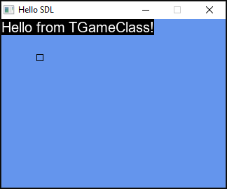

# Learning SDL2 with Pascal

A basic example of how to use SDL2 and SDL2_ttf based on the tutorials from [freepascal-meets-sdl.net](https://www.freepascal-meets-sdl.net).

I'm using Lazarus IDE v3.4 because it's easier to setup.

This project uses a separate unit file (it's an equivalent of a namespace file in C#) for the game class declaration.
